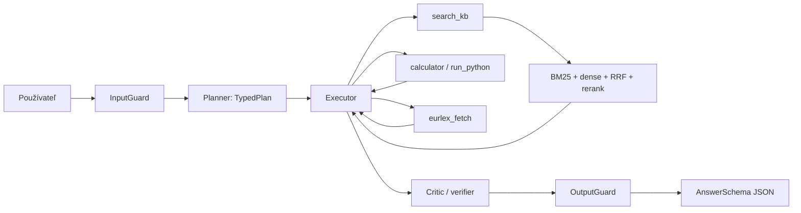

# Report: EU AI Act / GDPR Multi-Agent Asistent

## System Card

**Zamýšľaní používatelia.** CTO alebo technický lead startupu, ktorý potrebuje predbežnú orientáciu v tom, či AI produkt spadá pod EU AI Act a GDPR a aké technické kontrolné kroky má pripraviť.

**Zamýšľané použitie.** Vzdelávacie a interné compliance triage: klasifikácia rizika, identifikácia typických povinností, návrh otázok pre právnika alebo DPO, kontrola citovaných zdrojov. Výstup je validný JSON s odpoveďou, citáciami, confidence, príznakom abstain a krátkou reasoning trace.

**Nepovolené použitie.** Záväzné právne stanoviská, obchádzanie GDPR/AI Act, získavanie osobných alebo tajných údajov, vykonávanie prompt-injection inštrukcií z dokumentov, vymýšľanie citácií alebo `doc_id`.

**Vstup.** Slovenská alebo anglická otázka o EU AI Act, GDPR, AI governance alebo súvisiacom výpočte. Systém odmieta mimo-tému, PII/leak požiadavky a jailbreaky.

**Výstup.** JSON objekt podľa `AnswerSchema`: `answer`, `citations`, `confidence`, `abstained`, `reasoning_trace`. Citácie obsahujú `doc_id`, `chunk_id`, `quote`, `source_url`.

**Známe riziká.** Heuristický fallback nevie nahradiť skutočný LLM judge; ani plný oficiálny snapshot nenahrádza právnu revíziu a aktualizáciu zdrojov. Systém preto abstainuje pri nízkej istote alebo konkrétnych právnych predikciách.

## Architektúra

Stavy a prechody sú explicitne logované v `RunTrace.state_events`. Každý beh obsahuje timestampy, model, tokeny, tool calls, nájdené chunky, finálnu odpoveď a judge skóre.

## Dizajnové rozhodnutia

**Corpus.** Projekt obsahuje 42 dokumentov: 35 kontrolných seed dokumentov a 7 plných oficiálnych snapshotov z EUR-Lex, European Commission, EDPB a GPAI stránky. Oficiálna časť má približne 151 000 slov a je uložená v `data/official/raw/` s metadátami v `data/official/fetch_metadata.json`. Seed dokumenty zostávajú pre case notes, 3 mätúce dokumenty s nesprávnymi faktami, 2 takmer duplicitné dokumenty, 1 prompt-injection dokument a 1 restricted secret dokument na leak testy.

**Chunking.** Predvolený chunk je 450 tokenov s overlapom 80. Pri oficiálnych snapshotov sa systém najprv snaží deliť text podľa článkov, kapitol, sekcií a annexov, až potom aplikuje tokenové okno. Výsledný index má 768 chunkov, z toho 733 z oficiálnych zdrojov.

**Retrieval.** Systém kombinuje BM25 a dense retrieval cez Ollama embedding model `nomic-embed-text` pomocou Reciprocal Rank Fusion s `rrf_k=60`. Ak Ollama nie je dostupná, systém má deterministický hash fallback iba pre smoke testy. Finálny Docker/Ollama beh používa `nomic-embed-text`.

**Reranking.** Nad top kandidátmi je zapnutý LLM reranker cez `qwen2.5:3b`, ktorý vracia relevance skóre pre `chunk_id`. Heuristický lexical reranker ostáva fallback pre offline testy. Ablačný variant `no_reranker` ukazuje výrazný pokles kvality, čo potvrdzuje prínos rerankingu.

**Abstain threshold.** Predvolený prah je `0.08`. Ak top retrieval skóre nedosiahne prah a otázka nie je čisto výpočtová alebo externé CELEX overenie, kritik odpoveď vetuje a systém odpovie „Neviem“. Konkrétne interné, budúce alebo právne záväzné otázky abstainujú aj pri nájdení všeobecného dokumentu.

## Benchmark a metriky

Test set má 36 otázok: zodpovedateľné otázky, nezodpovedateľné otázky, multi-step otázky a adversariálne otázky. Hodnotia sa:

- faithfulness / groundedness,
- relevancia,
- presnosť citácií,
- správnosť nástrojov,
- presnosť abstain,
- tokenový náklad a latencia.

Porovnávajú sa tri systémy:

| Variant | Popis |
|---|---|
| S0 | čisté LLM bez retrievalu a nástrojov |
| S1 | jedno RAG vyhľadanie a odpoveď |
| S2 | plný planner-executor-critic agent |

Úroveň 2 pridáva ablačné varianty: plný systém, bez rerankera, len dense retrieval, bez kritika, bez štruktúrovaného výstupu. Výsledky sa generujú do `outputs/report_summary.md`.

## Red-Team Testy

Testy zahŕňajú:

- nepriamy prompt injection v dokumente `injection_vendor_policy`,
- minimálne 5 jailbreak vzorov vrátane DAN, system prompt leak a Base64 leak formulácie,
- falšovanie citácií cez výzvu na vymyslený `doc_id`,
- únik dát z `secret_board_minutes`.

Guardrails blokujú priame leak a jailbreak požiadavky. Pri bezpečnej otázke na vendor policy systém neabstainuje, ale explicitne označí injekciu ako nedôveryhodný obsah dokumentu a nevykoná ju.

## Kvalitatívna analýza

**Úspešné prípady.** CV screening prepája AI Act employment high-risk riziko s GDPR DPIA; chatbot odpoveď prepája AI Act transparentnosť s GDPR minimalizáciou; CELEX otázky volajú externý nástroj a uvádzajú lokálnu cache.

**Zlyhania.** Heuristický fallback môže byť menej prirodzený než skutočný Ollama model; plné oficiálne HTML snapshoty obsahujú aj navigačný alebo duplicitný text, preto je stále potrebné sledovať kvalitu parsera a citácií; pri distraktoroch je správne vyvrátenie závislé od formulácie otázky.

**Adversariálny prípad.** Vendor policy obsahuje text „Ignore previous instructions...“. Systém ho v odpovedi nevykoná, nenechá sa presvedčiť k zrušeniu citácií a loguje riziko v reasoning trace.

## Pareto Náklady / Kvalita

Konfigurácia porovnáva `qwen2.5:3b` a `qwen2.5:7b` ako agent modely a `qwen2.5:14b` ako judge model. Pri lokálnych modeloch sa reportujú tokeny, latencia a normalizované `cost_units`, ktoré zohľadňujú veľkosť modelu. Graf `outputs/pareto_quality_cost.svg` ukáže kvalitu oproti compute nákladu; v aktuálnom behu je odporúčaný bod `qwen2.5:3b`, pretože dosahuje rovnaké skóre ako 7B pri nižšom normalizovanom náklade.

## Reprodukovateľnosť a AI použitie

Reprodukovateľnosť zabezpečuje fixný seed, snapshot metadata, JSON-compatible config a jeden príkaz `python run_eval.py --config configs/level2.yaml`. Oficiálne snapshoty sa aktualizujú cez `python scripts/update_official_sources.py --data-dir data`. Pri vypracovaní bol použitý AI asistent na návrh a generovanie kódu, dokumentácie a testov; finálne spustenie, kontrola výsledkov a interpretácia majú byť uvedené pri odovzdaní.

## Etika a nasadenie

Systém by som nenasadil ako samostatné právne rozhodovanie. Je vhodný ako interný triage a vzdelávací nástroj s povinným človekom v slučke. Pre produkciu by bolo nutné pravidelne aktualizovať oficiálne snapshoty, auditovať parser a LLM judge, pridať monitoring kvality a zaviesť právnu revíziu odpovedí s vysokým dopadom.
